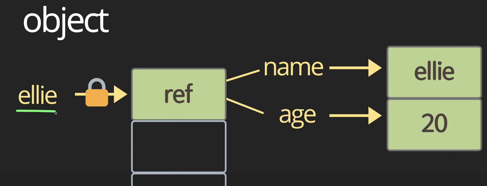

<br>

### 메모리
- 어플리케이션을 실행하면 어플리케이션마다 쓸 수 있는 메모리가 할당된다. 이 메모리는 크기가 제한적이다.
- `let nickname` : `let`이라는 키워드로 `nickname`이라는 변수를 정의하면 메모리를 가리킬 수 있는 포인터가 생성되고 `nickname` 변수에 `Jessie` 라는 값을 할당하면 메모리에 `Jessie`가 저장되는 것이다.
추후에 `nickname` 변수에 `Justin` 이라는 값을 다시 할당할 수 있다. 그러면 메모리에 `Justin` 값이 저장된다.

    

<br>

### let
- Block Scope

    ```jsx
    {
        let nickname = 'Jessie';
        console.log(nickname); // Jessie
        nickname = 'Justin';
        console.log(nickname); // Justin
    }

    console.log(nickname); // Uncaught ReferenceError: nickname is not defined
    ```

    - 괄호로 블럭을 설정해주고 그 안에 코드를 작성하면 블럭 밖에서는 블럭 안의 값을 볼 수 없게 된다.

<br>

### var
- var 변수 선언 키워드 쓰지 말자
- Function Scope

    ```jsx
    {
        var locate = 'Suji';
        console.log(locate); // Suji
    }

    console.log(locate); // Suji
    ```

    - var는 Function Scope이기 때문에 Block 안에 코드를 작성하더라도 Block 밖에서 읽을 수 있다.

    ```jsx
    function foo() {
        var company = 'MAXST';
        console.log(company); // MAXST
    }

    console.log(company); // VM1669:7 Uncaught ReferenceError: company is not defined
    ```

    - function 안에 있는 코드는 function 밖에서 읽을 수 없다.
- hoisting

    ```jsx
    console.log(age); // undefined
    age = 3;
    var age;
    ```

    - 만약 age 변수가 var가 아닌 let 으로 선언 되었다면 1행에서 Uncaught ReferenceError: age1 is not defined 에러가 난다. (정상)
    - var age 변수 선언 부분이 최상단으로 호이스팅되기 때문에 1행에서 에러가 나지 않고 undefined 가 출력되는 것이다.
    - 위의 코드는 아래의 코드와 동일한 코드라고 보면 된다.

        ```jsx
        var age;
        console.log(age); // undefined
        age = 3;
        ```
  
<br>

### const
- Block Scope
- 상수 (Immutable Type)
- 가능하면 const 키워드를 이용해서 값을 지정하는 것이 좋다. 반드시 변경이 가능해야 하는 변수만 let으로 선언하고 나머지는 다 const로 선언한다고 보면 된다.
- const 는 메모리를 가리키고 있는 포인터가 잠겨있다. 그래서 값을 선언함과 동시에 할당해야 하고 그 뒤로는 절대 다시는 값을 변경할 수 없다.

    

<br>

### Variable Types
- primitive type : 더 이상 작은 걸로 나눠질 수 없는 single item
    - number, string, boolean, null, undefined, symbol
- object, box container
- function, first-class function(function도 다른 데이터 타입처럼 변수에 할당이 가능하고 함수 파라미터로도 전달되고 리턴타입으로도 함수가 가능한 것을 first-class function이라고 한다)

<br>

#### object
- const로 object 를 선언하는 경우, 한 번 할당된 object는 다른 object로 변경이 불가하지만 object내 속성값은 변경이 가능하다.
    ```js
      const ellie = {
        name: 'ellie',
        age: 20,
      };
      
      ellie = { name: 'Jessie', age: 25 }; // Uncaught TypeError: Assignment to constant variable.
      
      ellie.name = 'Jessie'; // 가능
    
      console.log(ellie); // { name: 'Jessie', age: 20 }
    ```
    
    
    
<br>

### Reference
- [https://www.youtube.com/watch?v=OCCpGh4ujb8](https://www.youtube.com/watch?v=OCCpGh4ujb8)
    