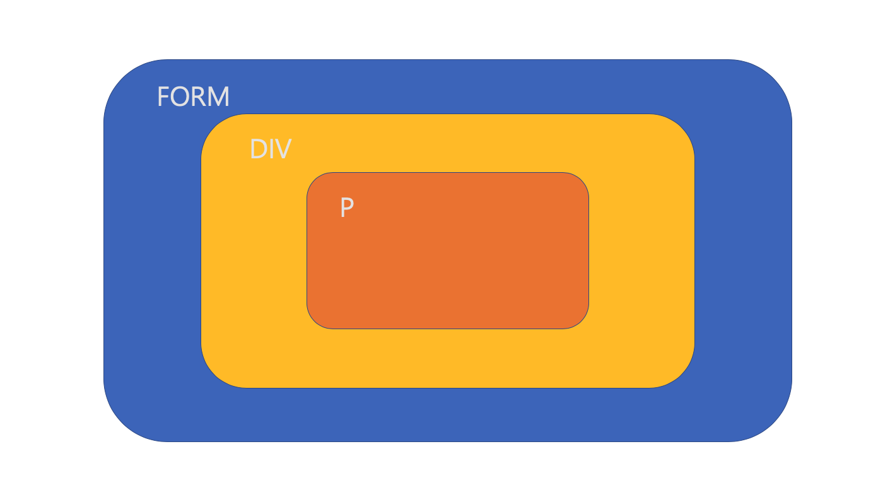
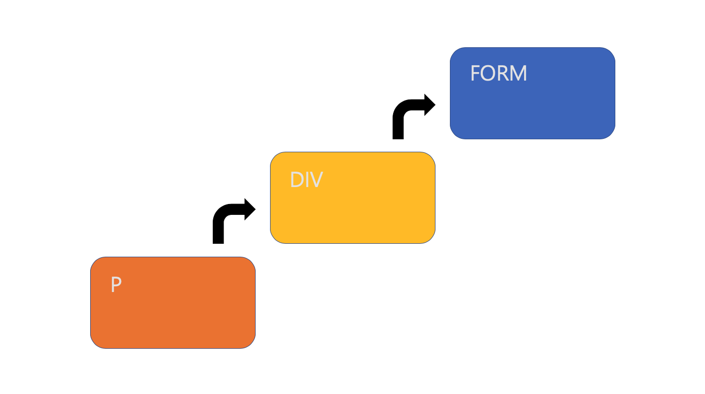
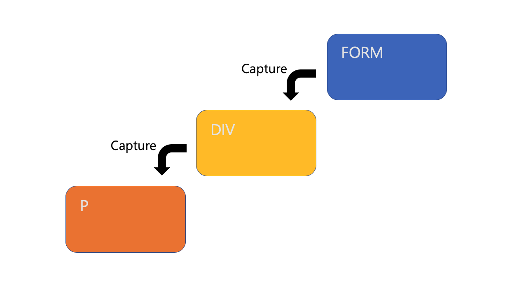

버블링과 캡쳐링을 본격적으로 알아보기 전에 간단한 코드를 한 번 살펴보자.

```html
<div onclick="alert('The DIV handler!')">
  DIV 태그
  <p>P 태그</p>
</div>
```

`div`태그에 `alert('The DIV handler!')`라는 이벤트 핸들러를 할당하였고, `p`태그에는 어떠한 핸들러도 할당하지 않았다.

그런데 `p`태그를 클릭해도 `div`태그에 할당된 핸들러가 실행이 된다.

> p 태그를 클릭했는데 왜 div 태그에 할당된 핸들러가 실행이 되는 것일까?

버블링 때문이다.

자바스크립트의 이벤트 버블링 때문에 위의 코드에서 `div`태그 안에 있는 `p`태그를 클릭하면 `div`태그에 할당된 클릭 이벤트가 발생하는 것이다.

그럼 버블링에 대해서 더 자세히 알아보자.

### 이벤트 버블링
#### “엘리먼트에 이벤트가 발생하면 먼저 해당 엘리먼트의 핸들러를 실행시킨 후, 그의 부모 엘리먼트의 핸들러를 실행시키고, 또 그 위의 조상 엘리먼트들의 핸들러를 차례로 실행시킨다”




마치 버블이 아래에서 위로 올라가는 것과 같아서 버블링이라고 한다. 아래의 예시를 보자.

```html
<form onclick="alert('form')">
  FORM
  <div onclick="alert('div')">
    DIV
    <p onclick="alert('p')">P</p>
  </div>
</form>
```

#### 실행 결과
<iframe height="265" style="width: 100%;" scrolling="no" title="eYYYewp" src="https://codepen.io/je_ss2/embed/eYYYewp?height=265&theme-id=0&default-tab=result" frameborder="no" allowtransparency="true" allowfullscreen="true">
  See the Pen <a href='https://codepen.io/je_ss2/pen/eYYYewp'>eYYYewp</a> by SoyeonJung
  (<a href='https://codepen.io/je_ss2'>@je_ss2</a>) on <a href='https://codepen.io'>CodePen</a>.
</iframe>

`form`태그에는 `alert('form')`클릭 이벤트를 줬고, `div`태그에는 `alert('div')`클릭 이벤트를 줬고, `p`태그에는 `alert('p')`클릭 이벤트를 줬다.

그런데 `p`태그는 `div`태그가 감싸고 있고, 또 그 `div`태그는 `form`태그가 감싸고 있다.

따라서 이벤트 버블링으로 인해서 아래와 같은 현상이 나타난다.
- `p`태그 클릭 : `p -> div -> form`순서로 알림창이 뜬다.
- `div`태그를 클릭 : `div -> form`순서로 알림창이 뜬다.

왜 하나의 태그를 클릭해도 여러 개의 이벤트가 발생하는 것일까? 브라우저가 이벤트를 감지하는 방식 때문이다.<br>
브라우저는 특정 화면 요소에서 이벤트가 발생했을 때 그 이벤트를 최상위에 있는 화면 요소까지 이벤트를 전파시킨다.

`p`태그를 클릭하면 `window`에서 부터 `p`태그까지 요소 중간에 있는 이벤트들을 전부 검색해서 따로 메모리에 가지고 있다고 생각하면 된다.

해당 엘리먼트부터 차례대로 위로 올라가면서 이벤트들을 발생시키는 것이 이벤트 버블링이다.

### 이벤트 캡쳐링

그렇다면 이번에는 이벤트 캡쳐링에 대해서 알아보자. 이벤트 캡쳐링도 이벤트 버블링과 비슷하다. 버블링이 아래에서 위로 올라가는 것이라면, **캡쳐링은 위에서 아래로 내려가는 것이다.**



`addEventListener`를 이용하여 버블링과 캡쳐링에 대해서 살펴보자.

capturing 단계에서 이벤트를 catch 하려면 `addEventListener`의 세 번째 요소를 `true`로 설정해줘야 한다.

기본적으로 `addEventListener`의 세 번째 요소를 작성하지 않으면 default 값이 `false`인데, `false`로 설정할 경우, 핸들러는 버블링 단계로 설정된다.

반면에 `true`로 설정할 경우, 핸들러는 캡쳐링 단계로 설정된다.

먼저 `addEventListener`의 세 번째 요소를 작성하지 않았을 경우를 살펴보자.

```html
<form>
  FORM
  <div>
    DIV
    <p>P</p>
  </div>
</form>
```

```js
for (let elem of document.querySelectorAll('*')) {
    elem.addEventListener("click", e => alert(elem.tagName));
}
```

#### 실행 결과
<iframe height="265" style="width: 100%;" scrolling="no" title="Event Bubbling" src="https://codepen.io/je_ss2/embed/JjjjMjN?height=265&theme-id=0&default-tab=result" frameborder="no" allowtransparency="true" allowfullscreen="true">
  See the Pen <a href='https://codepen.io/je_ss2/pen/JjjjMjN'>Event Bubbling</a> by SoyeonJung
  (<a href='https://codepen.io/je_ss2'>@je_ss2</a>) on <a href='https://codepen.io'>CodePen</a>.
</iframe>

`p`태그를 클릭하면 `P -> DIV -> FORM -> BODY -> HTML`순서로 알림창이 열린다.

`addEventListener`의 세 번째 요소를 작성하지 않아서 기본값인 `false`로 되었기 때문에 핸들러가 버블링 단계로 설정되었기 때문이다.

이번에는 `addEventListener`의 세 번째 요소를 `true`로 작성해보자.

```html
<form>
  FORM
  <div>
    DIV
    <p>P</p>
  </div>
</form>
```

```js
for(let elem of document.querySelectorAll('*')) {
    elem.addEventListener("click", e => alert(elem.tagName), true);
}
```

#### 실행 결과
<iframe height="265" style="width: 100%;" scrolling="no" title="event-capturing" src="https://codepen.io/je_ss2/embed/jOOOYEg?height=265&theme-id=0&default-tab=result" frameborder="no" allowtransparency="true" allowfullscreen="true">
  See the Pen <a href='https://codepen.io/je_ss2/pen/jOOOYEg'>event-capturing</a> by SoyeonJung
  (<a href='https://codepen.io/je_ss2'>@je_ss2</a>) on <a href='https://codepen.io'>CodePen</a>.
</iframe>
`p`태그를 클릭하면 `HTML -> BODY -> FORM -> DIV -> P`순서로 알림창이 열린다.

`addEventListener`의 세 번째 요소를 `true`로 작성했기 때문에 핸들러가 **캡쳐링 단계**로 설정되었기 때문이다.

### event.stopPropagation()

기본적으로 이벤트 버블링은 항상 발생하는데 이 이벤트 버블링을 멈추게 할 수 있다. 우선 아래의 코드를 보자.

```html
<form onclick="alert('form')">
  FORM
  <div onclick="alert('div')">
    DIV
    <p>P</p>
  </div>
</form>
```

#### 실행 결과
<iframe height="265" style="width: 100%;" scrolling="no" title="event-bubbling-2" src="https://codepen.io/je_ss2/embed/PoooEwy?height=265&theme-id=0&default-tab=result" frameborder="no" allowtransparency="true" allowfullscreen="true">
  See the Pen <a href='https://codepen.io/je_ss2/pen/PoooEwy'>event-bubbling-2</a> by SoyeonJung
  (<a href='https://codepen.io/je_ss2'>@je_ss2</a>) on <a href='https://codepen.io'>CodePen</a>.
</iframe>

`form`태그와 `div`태그에만 이벤트 핸들러를 주고, `p`태그에는 이벤트 핸들러를 주지 않았지만 이벤트 버블링으로 인해 `p`태그를 클릭하면 `div -> form`순서로 알림창이 뜬다.

이러한 이벤트 버블링이 발생되길 원하지 않는다면 `event.stopPropagation()`을 이용해서 간단하게 멈출 수 있다. 아래의 코드를 보자.

```html
<form onclick="alert('form')">
  FORM
  <div onclick="alert('div')">
    DIV
    <p onclick="event.stopPropagation()">P</p>
  </div>
</form>
```

#### 실행 결과
<iframe height="265" style="width: 100%;" scrolling="no" title="stopPropagation-2" src="https://codepen.io/je_ss2/embed/RwwwxNy?height=265&theme-id=0&default-tab=result" frameborder="no" allowtransparency="true" allowfullscreen="true">
  See the Pen <a href='https://codepen.io/je_ss2/pen/RwwwxNy'>stopPropagation-2</a> by SoyeonJung
  (<a href='https://codepen.io/je_ss2'>@je_ss2</a>) on <a href='https://codepen.io'>CodePen</a>.
</iframe>

`p`태그에 `onclick="event.stopPropagation()"`를 주면 `p`태그를 클릭해도 아까처럼 이벤트가 발생하지 않는다. 이벤트 버블링이 작동하지 않기 때문이다.

아래와 같이 함수에 `event.stopPropagation()`를 사용해서 어떠한 태그를 클릭해도 이벤트 버블링이 발생하지 않도록 할 수 있다.

```html
<form>
  FORM
  <div>
    DIV
    <p>P</p>
  </div>
</form>
```
```js
for (let elem of document.querySelectorAll('*')) {
    elem.addEventListener("click", e => alertEvent(e, elem.tagName));
}

function alertEvent(event, _tagName) {
	event.stopPropagation();
	alert(_tagName);
}
```

#### 실행 결과
<iframe height="265" style="width: 100%;" scrolling="no" title="Event Bubbling-2" src="https://codepen.io/je_ss2/embed/yLLLpyy?height=265&theme-id=0&default-tab=result" frameborder="no" allowtransparency="true" allowfullscreen="true">
  See the Pen <a href='https://codepen.io/je_ss2/pen/yLLLpyy'>Event Bubbling-2</a> by SoyeonJung
  (<a href='https://codepen.io/je_ss2'>@je_ss2</a>) on <a href='https://codepen.io'>CodePen</a>.
</iframe>

이제 `form`태그를 클릭하면 `form`알림창만 뜨고, `div`태그를 클릭하면 `div`알림창만 뜨고, `p`태그를 클릭하면 `p`알림창만 뜬다.
