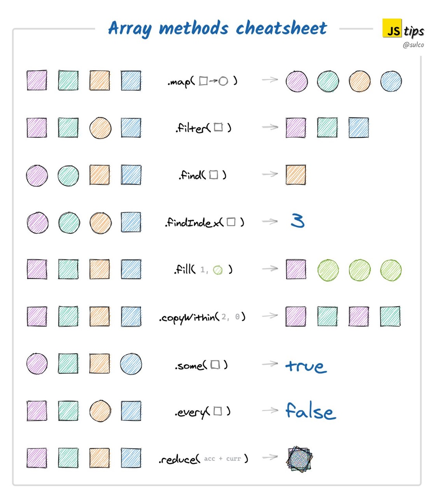
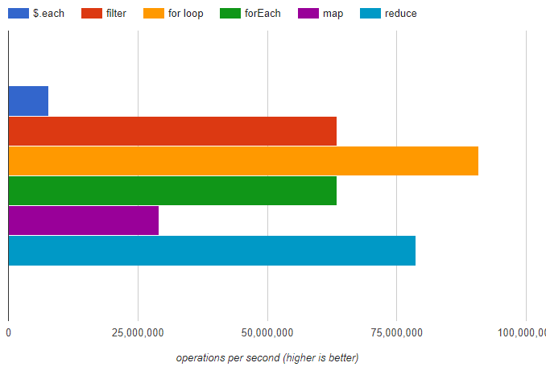

# 0. Index
1. [고차 함수란?](#1-고차-함수란)
2. [많이 사용되는 배열 고차 함수들](#2-많이-사용되는-배열-고차-함수들)
    - [forEach](#2-1-arrayprototypeforeach)
    - [map](#2-2-arrayprototypemap)
    - [filter](#2-3-arrayprototypefilter)
    - [reduce](#2-4-arrayprototypereduce)
    - [some](#2-5-arrayprototypesome)
    - [every](#2-6-arrayprototypeevery)
    - [find](#2-7-arrayprototypefind)
    - [findIndex](#2-8-arrayprototypefindindex)
    - [fill](#2-9-arrayprototypefill)
    - [sort](#2-10-arrayprototypesort)
    - [includes](#2-11-arrayprototypeincludes)
3. [다양한 고차 함수들 시각화 비교](#3-다양한-고차-함수들-시각화-비교)
4. [성능 비교](#4-성능-비교)

<br />

# 1. 고차 함수란?
함수를 인자로 전달받거나 함수를 결과로 반환하는 함수

<br />

# 2. 많이 사용되는 배열 고차 함수들
### 2-1. Array.prototype.forEach
- 단순 반복문
- 주어진 함수를 배열 요소 각각에 대해 반복 실행
- `undefined`를 반환
- 일반 `for` 문과는 달리 `break` 문을 사용할 수 없음

```js
const arr = [1, 2, 3, 4, 5];

const result = arr.forEach(arrItem => {
  console.log(arrItem); // 1, 2, 3, 4, 5가 차례로 출력된다.
});

console.log(result); // undefined
```

<br />

### 2-2. Array.prototype.map
- 배열 내의 모든 요소 각각에 대하여 주어진 함수를 호출한 결과를 모아 새로운 배열을 반환
- 배열 내 요소들을 가공해서 새로운 배열을 만들어내야 할 때 사용
- 기존 배열 길이와 새롭게 만들어진 배열의 길이는 동일하다.

```js
const arr = [1, 2, 3, 4, 5];

const result = arr.map(arrItem => {
  console.log(arrItem); // 1, 2, 3, 4, 5가 차례로 출력된다.
  return arrItem * 2;
});

console.log(result); // [2, 4, 6, 8, 10]
```

<br />

### 2-3. Array.prototype.filter
- 주어진 함수의 테스트를 통과하는 모든 요소를 모아 새로운 배열로 반환
- 기존 배열의 요소 중에 특정 조건에 만족하는 요소만 모아서 새로운 배열로 반환하기 때문에 기존 배열 길이와 새롭게 만들어진 배열의 길이는 다를 수 있다.

```js
const arr = [1, 2, 3, 4, 5];

const result = arr.filter(arrItem => {
  console.log(arrItem); // 1, 2, 3, 4, 5가 차례로 출력된다.
  return arrItem % 2 === 0;
});

console.log(result); // [2, 4]
```

<br />

### 2-4. Array.prototype.reduce
- 배열의 각 요소에 대해 주어진 리듀서(reducer) 함수를 실행하고, **하나의 결과값**을 반환
- 리듀서 함수는 누산기(acc)와 현재 값(cur)으로 누적 값을 계산한다.

```js
const arr = [1, 2, 3, 4, 5];

const result = arr.reduce((acc, cur) => {
  console.log(`${acc}+${cur}`); // 1+2, 3+3, 6+4, 10+5가 차례로 출력된다. 
  return acc + cur;
});

console.log(result); // 15
```

<br />

### 2-5. Array.prototype.some
- 배열 안의 주어진 판별 함수를 통과하는 요소가 하나라도 있으면 `true`, 하나도 없으면 `false` 반환
- 판별 함수를 통과하는 요소가 하나라도 있는 것이 확인되면 `true`를 반환하고 반복을 멈춘다.

```js
const arr = [1, 2, 3, 4, 5];

const result = arr.some(arrItem => {
  console.log(arrItem); // 1, 2 까지만 출력된다.
  return arrItem % 2 === 0;
});

console.log(result); // true
```

<br />

### 2-6. Array.prototype.every
- 배열 안의 모든 요소가 주어진 판별 함수를 통과하면 `true`, 전부 통과 못하면 `false` 반환
- 판별 함수를 통과하지 못하는 요소가 하나라도 있는 것이 확인되면 `false`를 반환하고 반복을 멈춘다.

```js
const arr = [1, 2, 3, 4, 5];

const result = arr.every(arrItem => {
  console.log(arrItem); // 1 까지만 출력된다.
  return arrItem % 2 === 0;
});

console.log(result); // true
```

<br />

### 2-7. Array.prototype.find
- 주어진 판별 함수를 만족하는 **첫 번째 요소의 값**을 반환
- 판별 함수를 만족하는 요소가 없다면 `undefined`를 반환

```js
const arr = [1, 2, 3, 4, 5];

const result = arr.find(arrItem => {
  console.log(arrItem); // 1, 2 까지만 출력된다.
  return arrItem % 2 === 0;
});

console.log(result); // 2
```

<br />

### 2-8. Array.prototype.findIndex
- 주어진 판별 함수를 만족하는 **첫 번째 요소의 인덱스**를 반환
- 판별 함수를 만족하는 요소가 없다면 `-1`을 반환

```js
const arr = [1, 2, 3, 4, 5];

const result = arr.findIndex(arrItem => {
  console.log(arrItem); // 1, 2 까지만 출력된다.
  return arrItem % 2 === 0;
});

console.log(result); // 1
```

<br />

### 2-9. Array.prototype.fill
- 배열의 시작 인덱스부터 끝 인덱스의 이전까지 정적인 값 하나로 채운다.
- `arr.fill(value[, start[, end]])`
- `value`만 지정하고 `start`, `end` 값을 지정하지 않는 경우 배열의 모든 요소가 해당 `value`로 채워진다.
- `value`, `start`만 지정하고 `end` 값을 지정하지 않는 경우 배열의 `start` 인덱스부터 배열 끝 요소까지 `value`로 채워진다.
- `value`, `start`, `end` 값을 모두 지정하는 경우 배열의 `start` 인덱스부터 `end - 1` 인덱스 요소까지 `value`로 채워진다.

```js
const arr = [1, 2, 3, 4, 5];

const result = arr.fill(0);

console.log(result); // [0, 0, 0, 0, 0]
```

```js
const arr = [1, 2, 3, 4, 5];

const result = arr.fill(0, 2);

console.log(result); // [1, 2, 0, 0, 0]
```

```js
const arr = [1, 2, 3, 4, 5];

const result = arr.fill(0, 2, 4);

console.log(result); // [1, 2, 0, 0, 5]
```

<br />

### 2-10. Array.prototype.sort
- 기존 배열의 요소를 정렬한 후 그 배열을 반환한다.
- 기본 정렬 순서는 문자열의 유니코드 코드 포인트를 따른다.

```js
const arr = [1000, 10, 3, 5, 9999, 1];

const result = arr.sort();

console.log(result); // [1, 10, 1000, 3, 5, 9999]
console.log(arr); // [1, 10, 1000, 3, 5, 9999]
```

```js
const arr = ['Justin', 'Jessie', 'Lia', 'Laura', 'Todd'];

const result = arr.sort();

console.log(result); // ["Jessie", "Justin", "Laura", "Lia", "Todd"]
console.log(arr); // ["Jessie", "Justin", "Laura", "Lia", "Todd"]
```

```js
const arr = [
  { name: 'Justin', temperature: 36.5 },
  { name: 'Jessie', temperature: 36 },
  { name: 'Lia', temperature: 35.8 },
  { name: 'Laura', temperature: 36.1 },
  { name: 'Todd', temperature: 35.9 },
]

// temperature 기준 오름차순 정렬
const result = arr.sort(function (a, b) {
  if (a.temperature > b.temperature) {
    return 1;
  }
  if (a.temperature < b.temperature) {
    return -1;
  }
  // a must be equal to b
  return 0;
});

console.log(arr === result); // true
console.log(arr);
/*
[
  { name: 'Lia', temperature: 35.8 },
  { name: 'Todd', temperature: 35.9 },
  { name: 'Jessie', temperature: 36 },
  { name: 'Laura', temperature: 36.1 },
  { name: 'Justin', temperature: 36.5 },
]
*/

```

<br />

### 2-11. Array.prototype.includes
- 배열이 특정 요소를 포함하고 있는지 판별
- 특정 요소를 포함하고 있으면 `true`를 반환, 포함하고 있지 않으면 `false` 반환

```js
const arr = [1, 2, 3, 4, 5];

const result = arr.includes(2)

console.log(result); // true
```

<br />

# 3. 다양한 고차 함수들 시각화 비교



<br />

# 4. 성능 비교


### Best ~ Worst
1. for loop `Best`
2. reduce
3. forEach, filter
4. map
5. $.each `worst`
