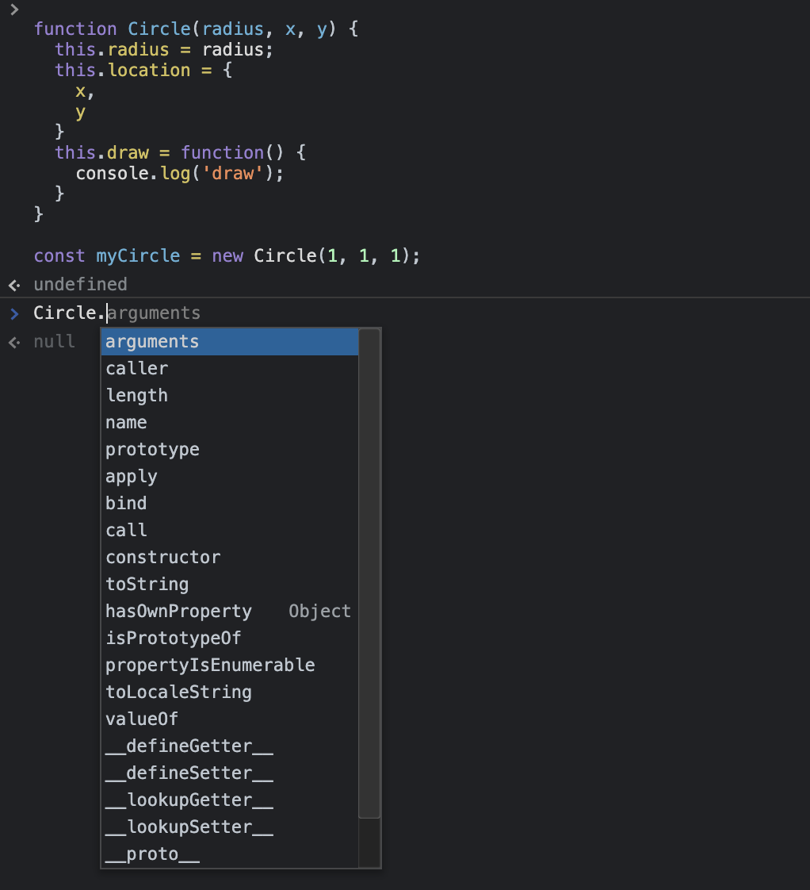
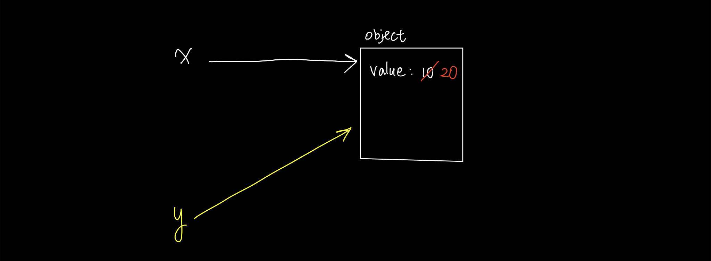

## 0. Table of Contents

1. [What is OOP](/JavaScript/oop-1/) 
1. **[Objects](/JavaScript/oop-2/)** ***👉 Current Page***
3. Prototypes *(TBD)*
4. Prototypical Inheritance *(TBD)*
5. ES6 Classes *(TBD)*
6. ES6 Modules *(TBD)*

<br />

## 1. Creating Objects

```js
const circle = {}; // using object literal syntax
```
- 중괄호 (`{}`)를 객체 리터럴 구문이라고 한다.

<br />

```js
const circle = {
  radius: 1,
  location: {
    x: 1,
    y: 1
  },
  draw: function() {
    console.log('draw');
  }
};
```
- 객체는 key-value 쌍을 가진다.
- value 값으로 객체나 함수도 가질 수 있다.
- 객체의 속성으로 존재하는 함수는 메소드라고 부른다.
- 위의 `circle` 객체는 Properties로 `radius`와 `location`가 있고 Methods로 `draw`가 있다.

<br />

```js
circle.draw(); // 출력 결과 : draw
```
- Dot (`.`)으로 객체의 Properties 및 Methods에 접근할 수 있다.

<br />

## 2. Factories and Constructors

#### 2-1. Factories
- Bad Example
    ```js
    const circle1 = {
      radius: 1,
      location: {
        x: 1,
        y: 1
      },
      draw: function() {
        console.log('draw');
      }
    };
    
    const circle2 = {
      radius: 2,
      location: {
        x: 2,
        y: 2
      },
      draw: function() {
        console.log('draw');
      }
    };
    ```

    - 서로 다른 객체 내의 각 draw 메소드는 동일한 역할을 한다. 이 때 draw 메소드를 객체를 생성할 때마다 넣게 되면 불필요한 코드 중복이 발생한다.
factory나 constructor function을 이용하여 해결할 수 있다. 아래의 Good Example을 보자.

<br />

- Good Example - Using Factory

    ```js
    // Factory Function
    function createCircle(radius, x, y) {
      return {
        radius,
        location: {
          x,
          y
        },
        draw: function() {
          console.log('draw');
        }
      };
    }
    
    const circle1 = createCircle(1, 1, 1);
    const circle2 = createCircle(2, 2, 2);
    ```
    - `createCircle`이라는 함수를 생성했다. 이 함수는 객체를 반환하고 객체 내의 속성은 함수의 매개변수로 받아오도록 처리한다.
    - 이와 같은 방식을 Factory Function 을 이용한 방식이라고 한다.
    - Factory Function을 이용하면 객체를 생성할 때마다 객체 내부의 메소드를 매번 다시 정의하지 않아도 된다.
    
<br />

#### 2-2. Constructors
```js
// Constructor Function
function Circle(radius, x, y) {
  this.radius = radius;
  this.location = {
    x,
    y
  }
  this.draw = function() {
    console.log('draw');
  }
}

const myCircle = new Circle(1, 1, 1);
console.log(myCircle.radius); // 1
```
- Constructor Function의 네이밍 컨벤션으로 첫 글자를 대문자로 한다.
- Factory Function이 Object를 return하는 방식이였다면, Constructor Function은 this 키워드를 사용하는 방식이다.
- Constructor Function을 이용해서 객체를 생성할 때는 new 키워드를 사용한다.
- new 키워드는 빈 객체(`{}`)를 생성하도록 하고 함수 내 `this`는 이 빈 객체를 가리키게 된다.
- `this`가 이 빈 객체를 가리키고 이 빈 객체에 `this.radius` 와 같은 방식으로 Properties와 Methods를 추가하는 것이다.
- new 키워드를 사용하면 Constructor Function이 자동으로 `return this`를 하게 된다.
- 따라서 Properties와 Methods가 추가된 이 객체가 반환되고 반환된 객체를 `myCircle`에 할당하고 있기 때문에 `myCircle.radius` 을 출력하면 정상적으로 `1`이 출력된다.
- 만약 new 키워드를 사용하지 않고 `const badCircle = Circle(2, 2, 2);`와 같이 작성했다면 함수 내 `this`는 `badCircle`가 아닌 `Window`(브라우저 기준)가 된다.
- constructor 속성
    ```js
    console.log(myCircle.constructor); // f Circle(...) {...}
    console.log(Circle.constructor); // f Object() {...}
    ``` 
    - 모든 Object 는 constructor 속성에 접근할 수 있다. 위의 코드에서 `myCircle.constructor`는 `Circle` 함수를 가리킨다.
    - 그리고 `Circle.constructor`는 자바스크립트에 내장된 함수인 `Object` 함수이다.

<br />

### 2-3. Functions are Objects
```js
function Circle(radius, x, y) {
  this.radius = radius;
  this.location = {
    x,
    y
  }
  this.draw = function() {
    console.log('draw');
  }
}

const myCircle = new Circle(1, 1, 1);
```

- 위의 `Circle` 함수는 사실 하나의 Object다.
- `Circle.` 을 입력하면 접근할 수 있는 멤버(methods, properties)들이 자동 추천 목록으로 뜬다.
(ex. apply, arguments, bind, call, caller, length, name, prototype, toString, ...)
    
- JavaScript의 모든 객체는 Constructor 속성이 있고 이 Constructor는 해당 객체를 생성할 때 사용되는 함수를 가리킨다.
- 함수는 객체라고 했기 때문에 위의 `Circle` 함수도 하나의 객체이므로 Constructor 속성을 가지고, 이 Constructor는 이 `Circle`을 생성할 때 사용된 함수를 가리킨다.  
따라서 `Circle.constructor` 을 출력해보면 `ƒ Function() { [native code] }` (자바스크립트에 내장된 Constructor인 function)가 출력된다.
- `function Circle() {...}` 와 같이 함수를 선언할 때, 자바스크립트 엔진은 function constructor을 이용해서 객체를 생성하게 된다.

<br />

## 3. Primitives and Reference Types

### 3-1. 두 가지의 타입 종류
- JavaScript에는 두 가지 타입 종류가 존재한다.
    1. Value Types (Primitives)
        - Number
        - String
        - Boolean
        - Symbol
        - undefined (ES6)
        - null (ES6)
    2. Reference Types
        - Object
        - Function
        - Array

<br />

### 3-2. Primitives와 Objects의 동작 방식 비교 
- Primitives와 Objects는 동작하는 방식이 다른데, JavaScript의 Prototypes를 이해하기 위해서는 반드시 꼭 알아야 한다.

<br />

- Primitives
    ```js
    let x = 10;
    let y = x;
    
    x = 20;
    
    console.log(x); // 20
    console.log(y); // 10
    ```
    - 위의 코드에서 `x`와 `y`는 완전히 독립된 두 개의 변수이다.
    - 처음 `x`에 10을 할당하고 그 이후에 `y`에 `x`를 할당한 후 `x`에 20으로 재할당하면 `x`는 20으로 변경되지만 `y`는 `x`의 변경과는 상관없이 여전히 10이다. 
    - 값을 변수에 할당할 때 해당 메모리 변수 내부에 해당 값이 저장된다.

<br />

- Objects
    ```js
    let x = { value: 10 };
    let y = x;
    
    x.value = 20;
    
    console.log(x.value); // 20
    console.log(y.value); // 20
    ```
    - `x.value`와 `y.value`는 모두 20이다.
    - 객체를 변수에 할당할 때 해당 객체는 해당 변수에 저장되지 않는다. 객체는 메모리의 다른 곳에 저장되고 해당 메모리 위치의 주소는 해당 메모리 변수 내부에 저장된다.
    - `let y = x;` 와 같이 `y`에 `x`를 할당하게 되면 참조 할당이 일어난다. 즉, 객체 자체가 복사되어 새로운 메모리에 할당되는 것이 아니라 해당 객체가 저장되어 있는 메모리의 주소값이 복사되는 것이다. 
    - 따라서 `x`와 `y`는 동일한 객체를 가리키게 되고 `x.value`의 값을 변경하면 `y.value`의 값도 변경되는 것이다.
        

<br />

- 결론
    - Primitives are copied by their value
    - Objects are copied by their reference
  
<br />
  
- Primitives are copied by their value - Example
    ```js
    let number = 10;
    
    function increase(number) { 
      number++;
    }
    
    increase(number);
    console.log(number); // 10;
    ```
    - `increase` 함수를 호출할 때 함수에서 받은 `number`라는 매개변수는 코드 1행의 `number`와는 완전히 별개의 변수이다.
    - 따라서 함수 내부에서 `number`의 값을 증가시키더라도 1행의 `number`와는 상관이 없기 때문에 코드 마지막 행에서 `number`값을 출력하면 10이 출력된다. 
    
<br />
    
- Objects are copied by their reference - Example
    ```js
    let obj = { value: 10 };
    
    function increase(obj) { 
      obj.value++;
    }
    
    increase(obj);
    console.log(obj.value); // 11;
    ```
    - `increase` 함수를 호출할 때 함수에서 받은 `obj`라는 매개변수는 코드 1행의 `obj`와는 별개의 변수이지만 같은 객체 `{ value: 10 }`을 가리킨다. (객체는 참조 복사가 되기 때문.)
    - 따라서 함수 내부에서 `obj.value`의 값을 증가시키면 1행의 `obj`도 같은 객체를 가리키고 있기 때문에 코드 마지막 행에서 `obj.value`를 출력하면 11이 출력된다. 

<br />

## 4. Working with Properties

### 4-1. Adding or Removing Properties

```js
function Circle(radius) {
  this.radius = radius;
  this.draw = function() {
    console.log('draw');
  }
}

const circle = new Circle(10); // circle object 생성

circle.location = { x: 1 }; // location 속성 추가
console.log(circle); // { radius: 10, location: { x: 1 }, draw: f }

circle['name'] = 'c1';
console.log(circle); // { radius: 10, location: { x: 1 }, name: 'c1', draw: f }

delete circle['location'];
delete circle.name;
```
- 자바스크립트의 객체는 동적(dynamic)이다.
- 객체를 생성한 후에 해당 객체에 속성을 추가할 수 있고 또 속성을 삭제할 수 있다.
- 모든 속성을 미리 정의하지 않아도 필요에 따라 객체가 만들어진 이후에 속성을 추가할 수 있다는 장점이 있다.
- 객체의 속성은 `.`이나 `[]` 으로 접근/추가할 수 있다.
- Dot Notation(`.`)은 Brackets Notation(`[]`)보다 표기법이 심플하다.
- Bracket(`[]`)은 동적인 속성명으로 접근할 때 유용하다. ex) `circle[propertyName]`
- 또한 Bracket(`[]`)은 유효한 식별자가 아닌 속성 이름을 사용할 때 유용하다. 
    - `circle.center-location`과 같은 접근은 불가능하다.
    - `circle['center-location']`과 같은 접근은 가능하다.
- 객체의 속성을 제거할 때는 `delete` Operator 를 사용하면 된다. 

<br />

### 4-2. Enumerating Properties

- TBD

<br />

## 5. Private Properties

<br />

## 6. Getters and Setters

<br />

## 7. Exercise - Stop Watch

<br />

## Reference

- [Udemy - Object-oriented Programming in JavaScript](https://www.udemy.com/course/javascript-object-oriented-programming/)