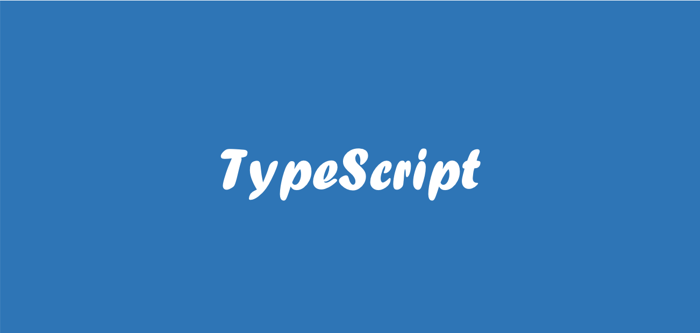

# 타입 호환성

- 타입 호환성이란? 어떤 타입을 다른 타입으로 취급해도 되는지 판단하는 것
- 정적 타입 언어의 가장 중요한 역할은 타입 호환성을 통해 컴파일 타임에 호환되지 않는 타입을 찾아내는 것
- B 변수가 A 변수에 할당 가능하기 위해서는 B 변수의 타입이 A 변수의 타입에 할당 가능해야 한다.
- 할당이 가능한 지 판단할 때는 타입이 가질 수 있는 값의 집합을 생각하면 된다.

<br />

### Example

```ts
function func1(a: number, b: number | string) {
	const v1: number | string = a;
	const v2: number = b; // v2에서 컴파일 에러
}

function func2(a: 1 | 2) {
	const v1: 1 | 3 = a; // v1에서 컴파일 에러
	const v2: 1 | 2 | 3 = a;
}
```

- 변수에 값을 할당할 때 할당이 불가능하면 컴파일 에러가 발생한다.
- `func1`에서 `v2`의 타입은 `number`이고, `b`의 타입은 `number` 또는 `string` 이다. 이 때, `b`는 `string`일수도 있는데 `number` 타입인 `v2`에 할당하려고 하니 에러가 발생하는 것이다.
- 마찬가지로 `func2`의 `a`가 `2`일 수 있는데, `1` 또는 `3` 타입을 가진 `v1`에 할당하려고 하니 에러가 발생한다.

<br />

### Structural Typing

```ts
interface Person {
	name: string;
	age: number;
}

interface Animal {
	name: string;
	age: number;
}

const p1: Person = { name: 'jessie', age: 23 };
const a1: Animal = p1;
```

- 타입스크립트는 값 자체의 타입보다는 값이 가진 내부 구조에 기반해서 타입 호환성을 검사한다.
- 위 코드에서 `Person`과 `Animal`는 서로 타입 이름이 다르지만 내부 구조는 같기 때문에 `Person`과 `Animal`는 서로 할당이 가능하다.
- 다른 많은 정적 타입 언어에서는 이런 경우 할당 가능하지 않지만 타입스크립트는 Structural Typing을 사용하기 때문에 할당 가능하다.
- 만약 위 코드에서 `Person` 인터페이스의 `age: number;` 부분을 지운다면, `Person`의 집합이 `Animal`의 집합보다 크기 때문에 `p1 = a1`은 가능하고 `a1 = p1` 는 불가능하다.

<br />

### 함수의 타입 호환성

```ts
type F1 = (a: number, b: string) => string;
type F2 = (a: number, b: number | string) => string;
type F3 = (a: number) => string;
type F4 = (a: number) => number | string;

let f1: F1 = (a, b) => `${a} ${b.length}`;
let f2: F2 = (a, b) => `${a} ${b}`;
let f3: F3 = a => `${a}`;
let f4: F4 = a => (a < 10 ? a : 'big');

f1 = f3;
f3 = f1; // f3에서 컴파일 에러

f1 = f2;
f2 = f1; // f2에서 컴파일 에러

f4 = f3;
f3 = f4; // f3에서 컴파일 에러
```

- 함수는 호출하는 시점에 문제가 없어야 할당이 가능하다.
- 함수 타입 B가 함수 타입 A로 할당 가능하기 위한 조건 (A = B)
    - A의 매개변수 개수 > B의 매개변수 개수
    - 같은 위치의 매개변수에 대해 A의 매개변수가 B의 매개변수로 할당 가능해야 함
    - B의 반환값은 A의 반환값으로 할당 가능해야함

<br />

### Reference
- [타입스크립트 시작하기](https://www.inflearn.com/course/%ED%83%80%EC%9E%85%EC%8A%A4%ED%81%AC%EB%A6%BD%ED%8A%B8-%EC%8B%9C%EC%9E%91%ED%95%98%EA%B8%B0/dashboard)