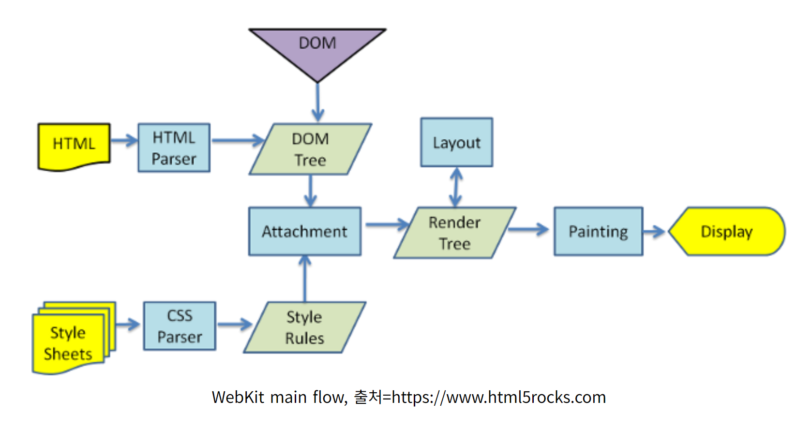

### 브라우저 주요 기능

사용자가 선택한 자원을 서버에 요청하고 브라우저에 표시하는 것이며 자원은 보통 HTML 문서지만 PDF나 이미지 또는 다른 형태일 수 있다.

브라우저는 HTML과 CSS 명세에 따라 HTML 파일을 해석해서 표시하는데 이 명세는 웹 표준화 기구인 W3C에서 정한다.

### 브라우저의 주요 구성 요소

1. 사용자 인터페이스
2. 브라우저 엔진 : 사용자 인터페이스와 렌더링 엔진 사이의 동작을 제어  
3. **<u>렌더링 엔진 : 요청한 콘텐츠를 표시. 예를들어 HTML 을 요청하면 HTML과 CSS를 파싱하여 화면에 표시</u>**
4. 통신 : HTTP 요청과 같은 네트워크 호출에 사용됨.
5. UI 백엔드 : OS 사용자 인터페이스 체계를 사용.
6. 자바스크립트 해석기 : 자바스크립트 코드를 해석하고 실행
7. 자료 저장소

### 렌더링 엔진

렌더링 엔진의 역할은 요청 받은 내용을 브라우저 화면에 표시한다.

렌더링 엔진은 HTML 및 XML 문서와 이미지를 표시할 수 있고 플러그인이나 브라우저 확장 기능을 이용해서  PDF와 같은 다른 유형도 표시할 수 있다.

### 렌더링 엔진 종류 중 하나인 '웹킷' 동작 과정



### 동작 과정

렌더링 엔진은 통신으로부터 요청한 문서의 내용을 얻는 것으로 시작하는데 문서의 내용은 보통 8KB 단위로 전송된다.

1. DOM 트리 구축을 위한 HTML 파싱
2. 렌더 트리 구축
3. 렌더 트리 배치
4. 렌더 트리 그리기

렌더링 엔진은 HTML 문서를 파싱하고 콘텐츠 트리 내부에서 태그를 DOM 노드로 변환한다.

그 다음, 외부 CSS 파일과 함께 포함된 스타일 요소도 파싱한다.

스타일 정보와 HTML 표시 규칙은 **렌더 트리**를 생성한다.

렌더 트리는 색상 또는 면적과 같은 시각적 속성이 있는 사각형을 포함하고 있는데 정해진 순서대로 화면에 표시한다.

렌더 트리 생성이 끝나면 배치가 시작되는데 이것은 각 노드가 화면의 정확한 위치에 표시되는 것을 의미한다.

그 다음은 UI 백엔드에서 렌더 트리의 각 노드를 가로지르며 형상을 만들어내는 그리기 과정이다.

### 1. DOM(Document Object Model), CSSOM(CSS Object Model) 생성

서버로부터 받은 HTML, CSS를 다운로드 받는다.

HTML, CSS는 단순한 텍스트 파일이므로 연산과 관리가 유리하도록 Object Model로 만들게 된다.

HTML, CSS 파일은 각각 DOM Tree와 CSSOM으로 만들어진다.

#### DOM


#### CSSOM


### 2. Render Tree 생성

DOM Tree와 CSSOM Tree가 만들어졌으면 그 다음으로는 이 둘을 이용하여 Render Tree를 생성한다.

순수한 요소들의 구조와 텍스트만 존재하는 DOM Tree와는 달리 Render Tree에는 스타일 정보가 설정되어 있으며 실제 화면에 표시되는 노드들로만 구성된다.


`display: none` 속성이 설정된 노드는 화면에 어떠한 공간도 차지하지 않는다.

따라서 Render Tree를 만드는 과정에서 제외된다.

`visibility: invisible`은 `display:none`과 비슷하게 동작하지만, 공간은 차지하고 요소가 보이지 않게만 하기 때문에 Render Tree에 포함된다.

### 3. Layout

Layout 단계는 브라우저의 뷰포트(Viewport) 내에서 각 노드들의 정확한 위치와 크기를 계산한다.

즉, 생성된 Render Tree 노드들이 가지고 있는 스타일과 속성에 따라서 브라우저 화면의 어느 위치에 어느 크기로 출력될지 계산하는 단계.

Layout 단계를 통해 %, vh, vw와 같이 상대적인 위치, 크기 속성은 실제 화면에 그려지는 pixel 단위로 변환된다.

여기서 뷰포트란, 그래픽이 표시되는 브라우저의 영역, 크기를 말한다.

뷰포트는 모바일의 경우 디스플레이의 크기, pc의 경우 브라우저 창의 크기에 따라 달라진다.

그리고 화면에 그려지는 각 요소들의 크기와 위치는 %, vh, vw와 같이 상대적으로 계산하여 그려지는 경우가 많기 때문에 viewport 크기가 달라질 경우 매번  계산을 다시해야 한다.

### 4. Paint

Layout 계산이 완료되면 이제 요소들로 실제 화면을 그리게 된다.

이전 단계에서 이미 요소들의 위치와 크기, 스타일 계산이 완료된 Render Tree를 이용해 실제 픽셀값을 채워넣는다.

이 때 텍스트, 색, 이미지, 그림자 효과 등이 모두 처리되어 그려진다.

이 때 처리해야 하는 스타일이 복잡할수록, Paint 단계에 소요되는 시간이 늘어나게 된다.

예를 들면, 단순한 단색 표현보다 그라데이션이나 그림자 효과 등이 painting 소요시간이 오래걸린다.

### 5. Reflow (Layout 다시 수행)

위에서 언급된 렌더링 과정을 거친 뒤에 최종적으로 페이지가 그려진다고 해서 렌더링 과정이 다 끝난 것이 아니다.

어떠한 액션이나 이벤트에 따라 html 요소의 크기나 위치 등 레이아웃 수치를 수정하면 그에 영향을 받는 자식 노드나 부모 노드들을 포함하여 layout 과정을 다시 수행한다.

이렇게 되면 Render Tree와 각 요소들의 크기와 위치를 다시 계산하게 되는데 이 과정을 Reflow 라고 한다.

```js
// reflow 발생 예제
function reflow() { 
	document.getElementById('content').style.width = '600px'; 
}
```

- 페이지 초기 렌더링 (최초 Layout 과정)
- 윈도우 리사이징 (Viewport 크기 변경)
- 노드 추가 또는 제거
- 요소의 위치, 크기 변경 (left, top, margin, padding, border, width, height 등)
- 폰트 변경과 이미지 크기 변경 등

### 6. Repaint (Paint 다시 수행)

Reflow만 수행되면 실제 화면에 반영되지 않는다.

위에서 언급된 렌더링 과정과 같이 Render Tree를 다시 화면에 그려주는 과정이 필요하다.

결국은 Paint 단계가 다시 수행되는 것이며 이를 Repaint라고 한다.

하지만 무조건 Reflow가 일어나야 Repaint가 일어나는 것은 아니다.

background-color, visibility와 같이 레이아웃에는 영향을 주지 않는 스타일 속성이 변경되었을 때는 Reflow(계산)를 수행할 필요가 없기 때문에 Repaint만 수행한다.

### Reflow, Repaint 줄이기

#### 1. 사용하지 않는 노드에는 `visibility: invisible` 보다 `display: none` 사용하기

`visibility: invisible`은 레이아웃 공간을 차지하기 때문에 reflow 대상이 된다.

하지만 `display: none`은 레이아웃 공간을 차지하지 않아 Render Tree에서 아예 제외되어 reflow 대상이 되지 않는다.

따라서 사용하지 않는 노드에는 reflow 대상이 되지 않는 `display: none`을 사용하는 것이 좋다.

#### 2. Reflow, Repaint가 발생하는 속성 사용 피하기

Reflow Repaint가 일어나지 않는 `transform`, `opacitiy`와 같은 속성도 있다.

따라서 `left`, `right`, `width`, `height` 보다 `transform`을, `visibility/display` 보다 `opacitiy`를 사용하는 것이 성능 개선에 도움이 된다.

### Virtual Dom

일반적으로 dom에 접근하여 여러번의 속성 변화, 여러번의 스타일 변화를 수행하면 그에따라 여러번의 Reflow, Repaint가 발생한다. 

**하지만 Virtual DOM은 이렇게 변화가 일어나 Reflow, Repaint가 필요한 것들을 한번에 묶어서 dom에 전달한다.** 

따라서 처리되는 Reflow, Repaint의 규모가 커질 수는 있지만 한번만 연산을 수행하게 된다.

이를 통해 여러번 Reflow, Repaint를 수행하며 연산이 반복적으로 일어나는 부분이 줄어들어 성능이 개선되는 것이다.